# Comparing 3 Models on BDD100k Dataset

*Quick Note: We configured each model according to the best practices rather than keeping parameters constant, Because in real life, you would deploy the best version of each architecture*

### Models & MIOU
- U-Net:      59.14%
- DeepLabV3+: 58.33%
- SegFormer:  60.12%

### Dataset: BDD100k
This dataset includes thousands of diverse dashcam images. This includes night, heavy weather, and much more. 
Although the dataset says 100k images, their segmentation dataset is much smaller at 10k images.

For each run I ran the same data pipeline:
- Removed 8 bad pairs, these images had differing H,W from input to label
- Read input image and converted to rgb
- Read label image with Grayscale
- Preloaded all pairs into memory (only about 37gb of memory at full 720p resolution)
- Ran albumentations:
    - Resize
    - Horizontal Flip
    - Color Jitter
    - Affine
    - Normalize
    - To Tensor

### Metric for Success
MIOU: Mean Intersection over Union

This metric takes the area of overlap divided by the area of union, or in simpler terms:

$$
\frac{\text{True Positives}}{\text{True Positives} + \text{False Positives} + \text{False Negatives}}
$$
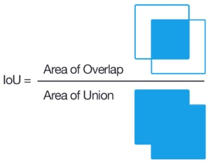

# U-Net

- Parameters:
    - lr = 1e-3
    - encoder = 'efficientnet-b4'
    - encoder_weights = 'imagenet'
    - batch_size = 32
    - num_epochs = 50
    - patience = 7

- dtype = bfloat16
- Input Resolution = 360, 640
- Training GPU = A100
- Loss = Focal + Dice
    - **Focal Loss**: This loss function is for extreme class imbalances. in BDD100k there are multiple classes that barely take up any image space. This function works perfectly to combat that.
    - **Dice Loss**: This loss function is also perfect for class imbalance. Additionally, it works directly in tandem with MIOU helping us optimize for our metric. 
- Optimizer = AdamW
- Scheduler = Cosine Annealing
    - Specifically works great with U-Net

## Results

| MIOU   | MIOU (Train Excl) | Iterations | Params | MACs  | Latency | FPS  | Size   |
|--------|-------------------|------------|--------|-------|---------|------|--------|
| 59.14% | 62.43%            | ~11k        | 2.8M   | 11.9G | 22.78ms | 43.9 | 81.9MB |

*Quick Latency Notes: A100, 360x640, bfloat16, batch size 1*

Training Loss:
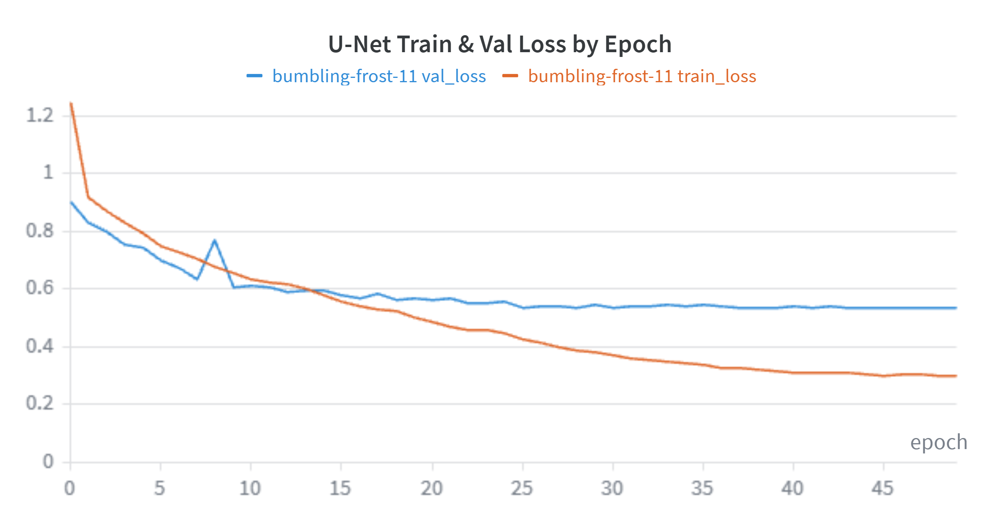

We had a val loss hiccup on iteration 7, this is attributed to the Cosine Scheduler

Per Class IOU:

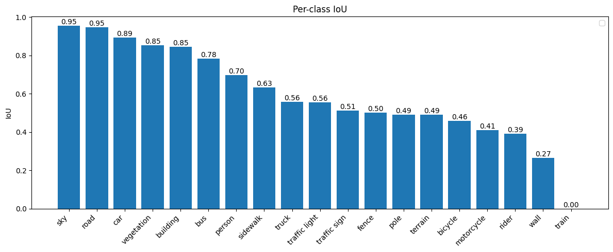

The model struggles with classes that do not make up a lot of the image. Even with focal loss there is simply not enough data to get high accuracy in low frequency classes. The train class occurs basically zero times within the data which can be seen by the 0 IOU score.

Example Output:

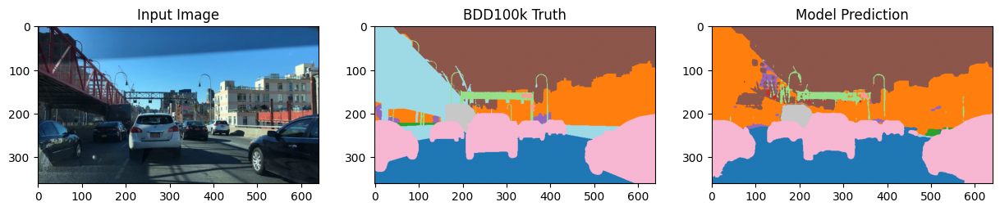

This is impressive for an architecture that came out 11 years ago.

# DeepLabV3+

- Parameters
    - learning rate
        - encoder = 1e-4
        - decoder = 5e-4
        - segmentation head = 5e-4
    - encoder = 'resnet101'
    - encoder_weights = 'imagenet'
    - batch_size = 32
    - num_epochs = 80
    - patience = 14

- dtype = bfloat16
- Input Resolution = 360, 640
- Training GPU = A100
- Loss = (Focal * 0.4) + (Dice * 0.6)
    - **Focal Loss**: This loss function is for extreme class imbalances. in BDD100k there are multiple classes that barely take up any image space. This function works perfectly to combat that.
    - **Dice Loss**: This loss function is also perfect for class imbalance. Additionally, it works directly in tandem with MIOU helping us optimize for our metric. 
- Optimizer = AdamW
- Scheduler = PolynomialLR

## Results

| MIOU   | MIOU (Train Excl) | Iterations | Params | MACs  | Latency | FPS  | Size   |
|--------|-------------------|------------|--------|-------|---------|------|--------|
| 58.33% | 61.57%            | ~10K        | 45.7M   | 56.5G | 14.67ms | 68.2 | 183.4MB |

*Quick Latency Notes: A100, 360x640, bfloat16, batch size 1*

Training Loss:
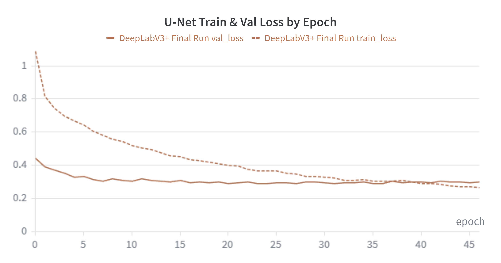

Per Class IOU:

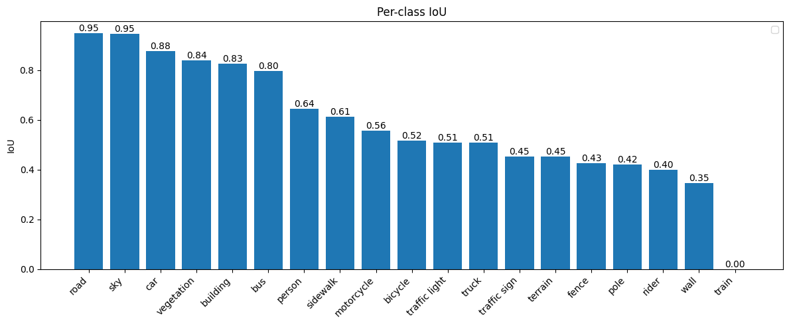

Even though DeepLabV3+ is newer it scored a lower MIOU than U-Net, there are a couple reasons for this.
1. Training Data: The training data is a lot smaller than what this model would expect. ResNet101 and ASPP is pretrained on much larger datasets.
2. DeepLabV3+ & ASPP: ASPP allows this architecture to look at a much wider area while only analyzing the same amount of pixels. for example with r=2 it will cover a 6x6 square but only look at every other pixel. This helps with larger regions but with thin specific details like a fence or a pole it performs much worse.
3. Asymmetry: DeepLabV3+ moves away from the symmetric encoder and decoder layers. Instead relying on the encoder to provide most of the work. This allows us to have much faster latency in turn for a little less MIOU.

ASPP Example:

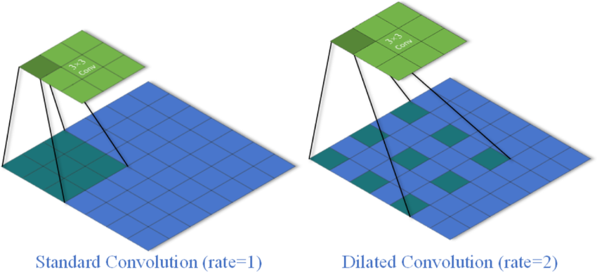

Example Output:

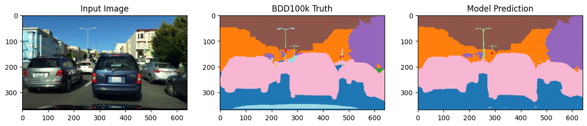

# Segformer

- Parameters
    - learning rate = 1e-4
    - encoder = 'mit_b3'
    - encoder_weights = 'imagenet'
    - batch_size = 32
    - num_epochs = 80
    - patience = 14

- dtype = bfloat16
- Input Resolution = 360, 640
- Training GPU = A100
- Loss = (Focal * 0.4) + (Dice * 0.6)
    - **Focal Loss**: This loss function is for extreme class imbalances. in BDD100k there are multiple classes that barely take up any image space. This function works perfectly to combat that.
    - **Dice Loss**: This loss function is also perfect for class imbalance. Additionally, it works directly in tandem with MIOU helping us optimize for our metric. 
- Optimizer = AdamW
- Scheduler = PolynomialLR

## Results

| MIOU   | MIOU (Train Excl) | Iterations | Params | MACs  | Latency | FPS  | Size   |
|--------|-------------------|------------|--------|-------|---------|------|--------|
| 60.12% | 63.47%            | ~21K        | 44.6M   | 35.9G | 31.30ms | 32.0 | 178.8MB |

*Quick Latency Notes: A100, 360x640, bfloat16, batch size 1*

My Google Colab instance failed halfway through this run. Luckily I had saved the best model and resumed from there. This causes a bit of a reset but both runs represent a single continuos run.

Training Loss:
PT 1:
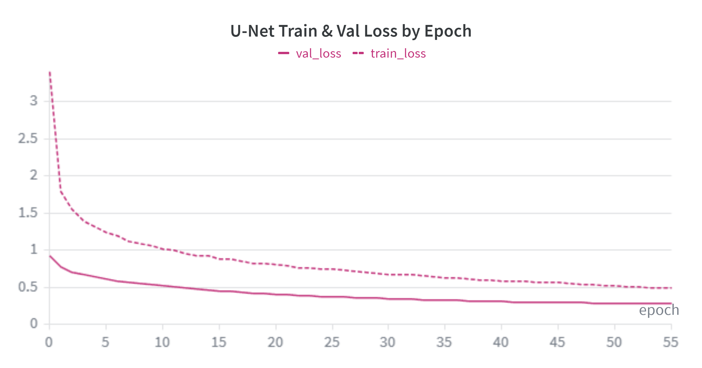
PT 2:
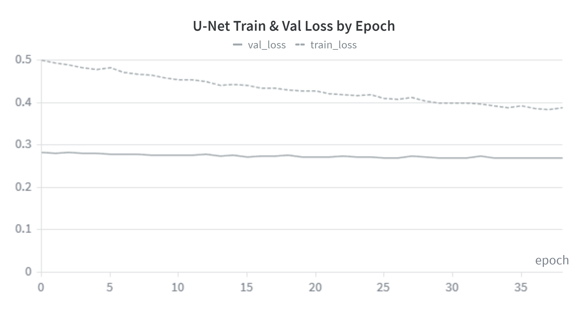

Per Class IOU:

Segformer ended with the highest MIOU! However, to achieve this we had to allow for almost double the iterations. This was needed because transformers are slower to converge.
This architecture is especially interesting because it works completely differently from the previous two. We are processing image patches with self-attention, not convolutions. 

Example Output:

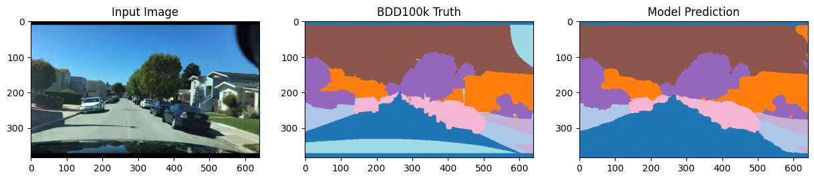

# What does this mean?

### Final Results Table:

|Architecture| MIOU   | MIOU (Train Excl) | Iterations | Params | MACs  | Latency | FPS  | Size    |
|------------|--------|-------------------|------------|--------|-------|---------|------|---------|
|U-Net       | 59.14% | 62.43%            | ~11k       | 2.8M   | 11.9G | 22.78ms | 43.9 | 81.9MB  |
|DeepLabV3+  | 58.33% | 61.57%            | ~10K       | 45.7M  | 56.5G | 14.67ms | 68.2 | 183.4MB |
|Segformer   | 60.12% | 63.47%            | ~21K       | 44.6M  | 35.9G | 31.30ms | 32.0 | 178.8MB |

### Per-Class IOU

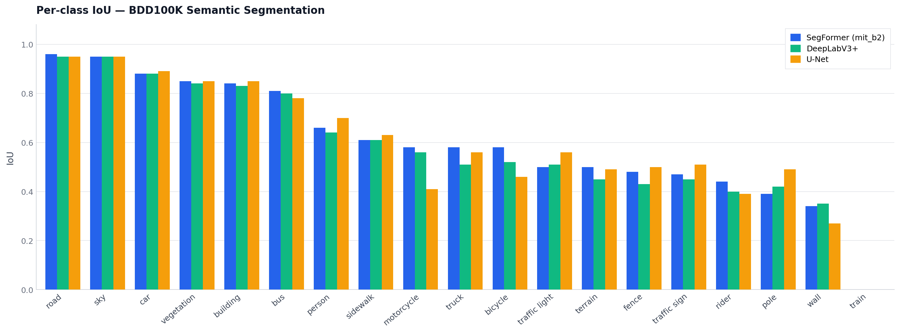

We have trained three fundamentally different architectures. U-Net is the oldest of the bunch and uses a CNN and skip connections, the parameters are extremely low and on a small dataset like this it still achieves an amazing MIOU. DeepLabV3+ uses an asymmetric approach with a heavy encoder and light decoder, additionally it uses ASPP to dilate its view of each section. For these reasons, DeepLabV3+ has a very low latency for the accuracy it provides. Segformer is the newest architecture of the three and revolutionized how segmentation models work, it implemented a transformer instead of convolutions. However, this comes with the downsides of long training times and higher latency.
With this experiment we can apply the correct architecture for our real life restrictions. DeepLabV3+ for latency concerns, Segformer for accuracy, and U-Net when the amount of data is low.
That being said, at the end of the day the bottleneck will almost always be the data quality, and not the model capacity.